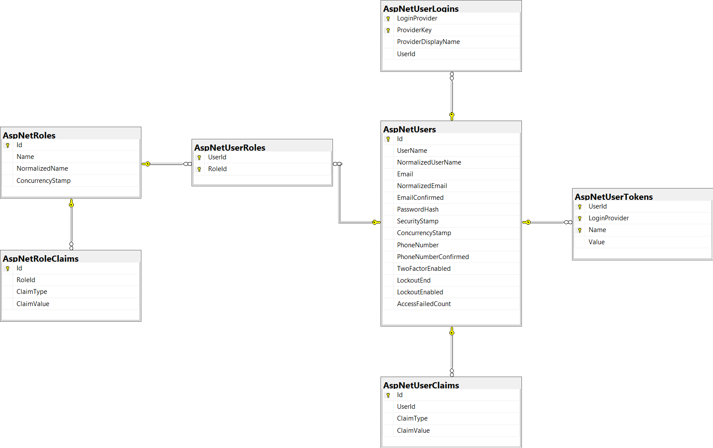
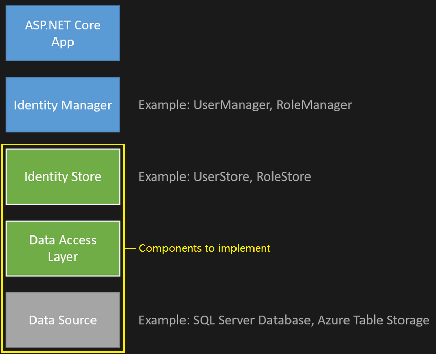

# Introduction to Identity on ASP.NET Core

- **NOT related** to the **Microsoft identity platform** (alternative identity solution).
- Add UI login functionality to **ASP.NET Core web apps** (you can scaffold all the pages to find out all the routes). Examples:
  - /Identity/Account/Login
  - /Identity/Account/Logout
  - /Identity/Account/Manage
  - /Identity/Account/RegisterConfirmation?email=\<email>
- Solutions to secure web APIs and SPAs:
  - [Microsoft Entra ID](https://learn.microsoft.com/en-us/azure/api-management/api-management-howto-protect-backend-with-aad)
  - [Azure Active Directory B2C (Azure AD B2C)](https://learn.microsoft.com/en-us/azure/active-directory-b2c/active-directory-b2c-custom-rest-api-netfw)
  - [Duende Identity Server](https://docs.duendesoftware.com/) (OIDC server)

## Scaffold Register, Login, Logout, and RegisterConfirmation

- Install package to scaffold identity pages:

  ```bash
  dotnet add package Microsoft.VisualStudio.Web.CodeGeneration.Design --version 8.0.7
  ```

- Command to scaffold identity pages:

  ```bash
  dotnet aspnet-codegenerator identity -dc ApplicationDbContext --files "Account.Register;Account.Login;Account.Logout;Account.RegisterConfirmation"
  ```

### Examine Register - `Register.cshtml.cs`

- `IUserStore<TUser>` - Provides API to set the user name.
- `IUserEmailStore<TUser>` - Provides API to set the user email.
- `UserManager<TUser>` - Provides APIs to manage user aggregate and its persistence store.
  - `CreateAsync(TUser)` - Create a new user.
  - `GenerateEmailConfirmationTokenAsync(TUser)` - Generate a token for email confirmation.

### Disable default account verification - `RegisterConfirmation.cshtml.cs`

- Default `Account.RegisterConfirmation` is used **only** for testing.
- Automatic account verification should be disabled in production.
  ```csharp
  public class RegisterConfirmationModel : PageModel
  {
      public async Task<IActionResult> OnGetAsync(string email, string returnUrl = null)
      {
          // ...
          DisplayConfirmAccountLink = true;
          // ...
      }
  }
  ```

### Log in, log out - `Login.cshtml.cs`, `Logout.cshtml.cs`

- `SignInManager<TUser>` - Provides APIs related to sign in.
  - `PasswordSignInAsync()`
  - `SignOutAsync()` - Clears the **user's claims** stored in a cookie.

## Test Identity

- Annotate classes or methods with `[Authorize]`.

## Identity Components

- **Primary package** - `Microsoft.AspNetCore.Identity` (included by `Microsoft.AspNetCore.Identity.EntityFrameworkCore`)

## `AddDefaultIdentity` and `AddIdentity`

- Calling `AddDefaultIdentity` is similar to calling `AddIdentity`, `AddDefaultUI` and `AddDefaultTokenProviders`:

  ```csharp
  services.AddAuthentication(o =>
  {
      o.DefaultScheme = IdentityConstants.ApplicationScheme;
      o.DefaultSignInScheme = IdentityConstants.ExternalScheme;
  })
  .AddIdentityCookies(o => { });

  services.AddIdentityCore<TUser>(o =>
  {
      o.Stores.MaxLengthForKeys = 128;
      o.SignIn.RequireConfirmedAccount = true;
  })
  .AddDefaultUI()
  .AddDefaultTokenProviders();
  ```

## Prevent publish of static Identity assets

- **Use case** - When you are not using the default UI.

  ```xml
  <PropertyGroup>
    <ResolveStaticWebAssetsInputsDependsOn>RemoveIdentityAssets</ResolveStaticWebAssetsInputsDependsOn>
  </PropertyGroup>

  <Target Name="RemoveIdentityAssets">
    <ItemGroup>
      <StaticWebAsset Remove="@(StaticWebAsset)" Condition="%(SourceId) == 'Microsoft.AspNetCore.Identity.UI'" />
    </ItemGroup>
  </Target>
  ```

# How to secure Web APIs

- Authentication schemes:

  | Scheme       | Application |
  | ------------ | ----------- |
  | Cookie-based | Browser     |
  | Token-based  | Mobile      |

## Install NuGet packages

- Commands to install the **main** _Identity_ package and _EF Core_ package:

  ```bash
  dotnet add package Microsoft.AspNetCore.Identity.EntityFrameworkCore --version 8.0.16
  dotnet add package Microsoft.EntityFrameworkCore.SqlServer --version 8.0.16
  dotnet add package Microsoft.EntityFrameworkCore.Tools --version 8.0.16
  ```

## Test the API

### Test login (support two authentication schemes)

- **Cookie-based** authentication
  - `/login?useCookies=true`
- **Token-based** authentication (custom token)
  - **Proprietary** to the ASP.NET Core Identity (not standard JWT).
  - Primarily for simple scenarios (not OAuth2).
  - Returns [AccessTokenResponse](https://learn.microsoft.com/en-us/dotnet/api/microsoft.aspnetcore.authentication.bearertoken.accesstokenresponse).
  - Call `/refresh` endpoint when the access token is about to expire.

## Log out

- Cookie-based authentication
  - Requires to define a custom logout endpoint and call `await signInManager.SignOutAsync()`.
- Token-based authentication
  - Just delete the token from the client storage.

## [The `MapIdentityApi<TUser>` endpoints](https://learn.microsoft.com/en-us/aspnet/core/security/authentication/identity-api-authorization?view=aspnetcore-9.0#the-mapidentityapituser-endpoints)

- Included endpoints:

  - `POST /register`
  - `POST /login`
  - `POST /refresh` - For use only with token-based authentication.
  - `GET /confirmEmail`

    - Upon `POST /register`, an email will be sent containing a request link to this endpoint.
    - To set up email confirmation:

      ```csharp
      // Program.cs

      builder.Services.Configure<IdentityOptions>(options =>
      {
          options.SignIn.RequireConfirmedEmail = true;
      });
      // [Optional] Customize emails sent.
      builder.Services.AddTransient<IEmailSender, EmailSender>();
      ```

    - More info: [Account confirmation and password recovery in ASP.NET Core](https://learn.microsoft.com/en-us/aspnet/core/security/authentication/accconfirm?view=aspnetcore-9.0)

  - `POST /resendConfirmationEmail`
  - `POST /forgotPassword`
    - Generates an **email** that contains a password **reset code**.
  - `POST /resetPassword`
    - Uses the reset code generated by `/forgotPassword` to set a new password.
  - `POST /manage/2fa`

    1. Send `{}` to initialize the shared key for the authenticator app.
    2. Set up the authenticator app using the generated shared key.
       - More info: [Enable QR code generation for TOTP authenticator apps in ASP.NET Core](https://learn.microsoft.com/en-us/aspnet/core/security/authentication/identity-enable-qrcodes?view=aspnetcore-9.0)
    3. Enable 2FA by sending:

       - Returns **recovery codes** (used to log in when the authenticator app isn't available).

       ```json
       {
         "enable": true,
         "twoFactorCode": "<TOTP>"
       }
       ```

    4. \[Optional] Reset the **recovery codes**:

       ```json
       {
         "resetRecoveryCodes": true
       }
       ```

    5. \[Optional] Reset the **shared key**:

       - **Disables the 2FA** (needs to be re-enabled).

       ```json
       {
         "resetSharedKey": true
       }
       ```

    6. Forget the machine to force passing of 2FA code for next login:

       - For cookie-based authentication, you don't have to pass the 2FA code every time you log in, as Identity has a mechanism to handle this via cookies.

       ```json
       {
         "forgetMachine": true
       }
       ```

  - `GET /manage/info`
  - `POST /manage/info`

    - Updates the email address and password of the logged-in user.

    ```json
    {
      "newEmail": "string",
      "newPassword": "string",
      "oldPassword": "string"
    }
    ```

# Add, download, and delete custom user data

- Command to scaffold a custom user class and identity pages:

  ```bash
  dotnet aspnet-codegenerator identity -u ApplicationUser -fi "Account.Register;Account.Manage.Index"
  ```

- If your project **does not have authentication** set up, **install** the following packages:

  ```bash
  dotnet add package Microsoft.AspNetCore.Identity.EntityFrameworkCore --version 8.0.16
  dotnet add package Microsoft.EntityFrameworkCore.SqlServer --version 8.0.16
  dotnet add package Microsoft.EntityFrameworkCore.Tools --version 8.0.16
  # 👇 For MVC or Razor Pages project only.
  dotnet add package Microsoft.AspNetCore.Identity.UI --version 8.0.16
  ```

- `[PersonalData]` - Include the custom properties (aka profile fields) for download via `POST /Identity/Account/Manage/DownloadPersonalData`.

  ```csharp
  // DownloadPersonalData.cshtml.cs

  var personalDataProps = typeof(ApplicationUser).GetProperties().Where(
    prop => Attribute.IsDefined(prop, typeof(PersonalDataAttribute)));
  ```

# \*Identity model customization in ASP.NET Core

## The Identity model

### Entity type relationships



### [Default model configuration](https://learn.microsoft.com/en-us/aspnet/core/security/authentication/customize-identity-model?view=aspnetcore-9.0#default-model-configuration)

### Model generic types

- **Default entity types** defined by Identity:
  - `IdentityUser`
  - `IdentityRole`
  - `IdentityUserClaim`
  - `IdentityUserToken`
  - `IdentityUserLogin`
  - `IdentityRoleClaim`
  - `IdentityUserRole`
- Can be used as **base classes** for the custom types.
- Use `IdentityDbContext` to use Identity with **support for roles**.
- Use `IdentityUserContext<TUser>` to use Identity **without roles (only claims)**.

## Customize the model

- When overriding `OnModelCreating`, `base.onModelCreating` should be **called first**.

### Change the primary key type

- Example:

  ```csharp
  public class ApplicationDbContext
      : IdentityDbContext<IdentityUser<Guid>, IdentityRole<Guid>, Guid>
  {
      public ApplicationDbContext(DbContextOptions<ApplicationDbContext> options)
          : base(options)
      {
      }
  }
  ```

- To register custom database context class:

  ```csharp
  services.AddIdentity<ApplicationUser, ApplicationRole>()
    .AddEntityFrameworkStores<ApplicationDbContext>()
    .AddDefaultUI()
    .AddDefaultTokenProviders();
  ```

### Add navigation properties

- `TKey` is the type specified for the **PK of users**.

# Configure ASP.NET Core Identity

## Identity options

- `IdentityOptions` must be set **after** calling `AddIdentity` or `AddDefaultIdentity`.

### Claims Identity

- `ClaimsIdentityOptions`

  | Property            | Default                     |
  | ------------------- | --------------------------- |
  | `UserIdClaimType`   | `ClaimTypes.NameIdentifier` |
  | `UserNameClaimType` | `ClaimTypes.Name`           |

### Lockout

- A successful authentication resets the failed access attempts count and resets the clock.

### Cookie settings

- `ConfigureApplicationCookie` must be called after calling `AddIdentity` or `AddDefaultIdentity`.

## `ISecurityStampValidator` and `SignOut` everywhere

- Context:
  - `ClaimsPrincipal` **should be regenerated** when joining a role, changing the password, or other security sensitive events.
  - Identity uses the `ISecurityStampValidator` to regenerate the `ClaimsPrincipal`.
  - Only relevant for **cookie-based** authentication.
- Validator hooks into the `OnValidatePrincipal` event, and calls in at regular **intervals** to **verify the user's security stamp**.
- Call `userManager.UpdateSecurityStampAsync(user)` to force **existing cookies to be invalidated**, in turn **sign out everywhere**.
- To **validate security stamp** every minute:

  ```csharp
  builder.Services.Configure<SecurityStampValidatorOptions>(o =>
    o.ValidationInterval = TimeSpan.FromMinutes(1));
  ```

# Custom storage providers for ASP.NET Core Identity

- This section covers the important **concepts**, but **isn't a step-by-step walkthrough**.

## Introduction

- By default, user information is stored in a **SQL Server** using **EF Core**.
- But, you can use a **different persistence mechanism** or **data schema**. E.g.:
  - Use **another data store** (e.g. [Azure Table Storage](https://learn.microsoft.com/en-us/azure/storage/)).
  - Database tables have a **different structure/schema**.
  - Use a **different data access approach** (e.g. [Dapper](https://github.com/DapperLib/Dapper)).

## The ASP.NET Core Identity architecture

- Consists of **classes** called **managers** and **stores**.
- **_Managers_**
  - **High-level classes** use to perform operations, such as creating an Identity user.
  - Decoupled from stores.
- **_Stores_**
  - **Lower-level classes** that specify **how entities (e.g. users, roles) are persisted**.
  - Follow the **repository pattern** and are closely **coupled with the persistence mechanism**.
- So, you can replace the persistence mechanism without changing your application code.
- **Identity architecture:**

  

## The data access layer

- Only need to create persistence mechanisms for features that you intend to use.
- Might include the following classes to store user and role information:
  - Context class
    - Encapsulates the **information to connect** to your persistence mechanism and **execute queries/perform data operation**.
  - Data access classes:
    - User Storage
    - Role Storage
    - UserClaims Storage
    - UserLogins Storage (external authentication provider)
    - UserRole Storage
- Example:

  ```csharp
  // In store class...

  public async Task<IdentityResult> CreateAsync(ApplicationUser user,
    CancellationToken cancellationToken = default(CancellationToken))
  {
    cancellationToken.ThrowIfCancellationRequested();
    if (user == null) throw new ArgumentNullException(nameof(user));

    return await _usersTable.CreateAsync(user);  // <--
  }
  ```

## Customize the user class

- At a minimum, your **user class** (custom) **must include** an `Id` and a `UserName` property.

## Customize the user store

- In your `UserStore` class, implement `IUserStore<TUser>` and the optional interfaces required.
- Within the `UserStore` class, use the **data access classes** (e.g. `AzureTableStorageUsersTable`, `DapperUsersTable`) to perform operations.
- More info: [Interfaces to implement when customizing user store](https://learn.microsoft.com/en-us/aspnet/core/security/authentication/identity-custom-storage-providers?view=aspnetcore-9.0#interfaces-to-implement-when-customizing-user-store)

### Optional interfaces (Inherit from `IUserStore<TUser>`)

- `IUserRoleStore`
- `IUserClaimStore`
- `IUserPasswordStore`
- `IUserSecurityStampStore`
- `IUserEmailStore`
- `IUserPhoneNumberStore`
- `IQueryableUserStore`
- `IUserLoginStore` - Implement to enable external authentication providers.
- `IUserTwoFactorStore`
- `IUserLockoutStore`

## Customize the role class

- No need to implement a particular interface, but:
  - **Must have** an `Id`.
  - Typically have a `Name` property.

## Customize the role store

- In your `RoleStore` class, implement `IRoleStore<TUser>` and optionally `IQueryableRoleStore<TRole>`.

# Account confirmation and password recovery in ASP.NET Core

- **Topics covered:** Email confirmation, password reset

## Configure an email provider

- Recommend using SendGrid or another email service rather than SMTP.
  - SMTP is difficult to secure and set up correctly.

## Resend email confirmation

### Change email and activity timeout

```csharp
// Program.cs

builder.Services.ConfigureApplicationCookie(o => {
    o.ExpireTimeSpan = TimeSpan.FromDays(5);
    o.SlidingExpiration = true;
});
```

### Change all data protection token lifespans

```csharp
// Program.cs

// Configure GLOBAL Identity token lifespans.
builder.Services.Configure<DataProtectionTokenProviderOptions>(o =>
{
    o.TokenLifespan = TimeSpan.FromHours(3);  // Default is one day.
});
```

## [Combine social and local login accounts](https://learn.microsoft.com/en-us/aspnet/core/security/authentication/accconfirm?view=aspnetcore-9.0&tabs=visual-studio#combine-social-and-local-login-accounts)

## Enable account confirmation after a site has users

- Two ways to handle:
  1. Update the database to mark all existing users are being confirmed.
  2. Batch-send emails with confirmation links.

# Enable QR code generation for TOTP authenticator apps in ASP.NET Core

- TOTP code should be **kept secret** because it can be used **multiple times** before it expires.
- 2FA does not happen using an external authentication provider.

## Adding QR codes to the 2FA configuration page

- Using [`qrcode.js`](https://davidshimjs.github.io/qrcodejs/).
